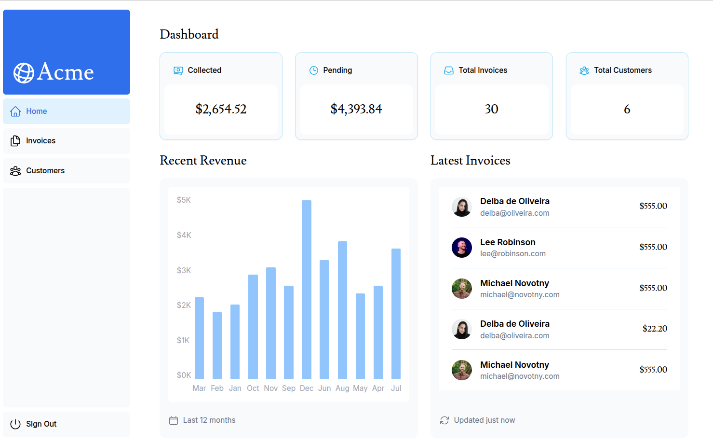

# 🧠 Next.js Dashboard App – Learning Project

This project was built as part of the official Next.js course:  
🔗 [Learn Next.js – Dashboard App](https://nextjs.org/learn/dashboard-app)

## 🖼️ Preview

## 🎯 Purpose

The goal of this project is to **deepen my understanding of modern web development** using Next.js and its new App Router architecture. It’s part of my continuous effort to grow as a frontend engineer and learn from official, up-to-date sources.

## 💡 What I Practice

- ✅ File-based routing & nested layouts with the App Router  
- ✅ Server and Client Components  
- ✅ Loading and error UI states  
- ✅ Route-based code splitting and prefetching  
- ✅ React best practices  
- ✅ Tailwind CSS integration  
- ✅ Basic auth flow with protected routes

## 🛠️ Stack

- **Next.js**
- **React**
- **TypeScript**
- **Tailwind CSS** 

## ✅ Outcome

This project is intended to help me strengthen core Next.js concepts and prepare for building scalable, real-world applications.

## 🔐 Test User
  Use the following credentials to log into the app:

  | Email: user@nextmail.com
  | Password: 123456

> Built for learning, growth, and applying modern best practices.

